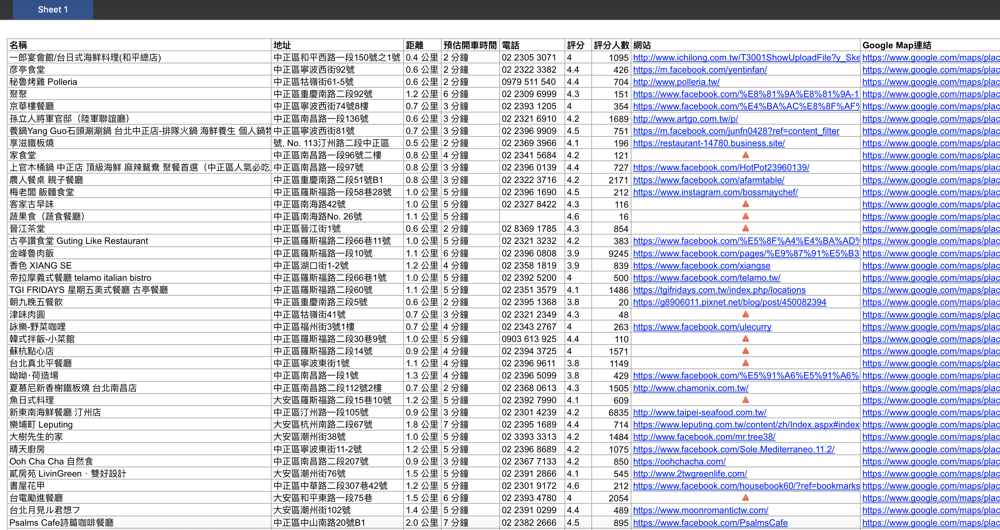

# 爬點神器

## 使用教學

### *Input*

#### step1．找到要搜尋地點的經緯度（打開google map 搜尋到該點後網址列@後到第二個逗號前就是他的經緯度了）

#### step2．打上你要搜尋的關鍵字例如：餐廳
#### step3．輸出的檔案名稱（可跳過，系統會直接以關鍵字為預設檔名）

### *Output*

#### 1．該點附近的資料都會按照你的關鍵字去搜尋並匯出在檔案中
#### 2．資料會輸出成excel檔放在電腦桌面

